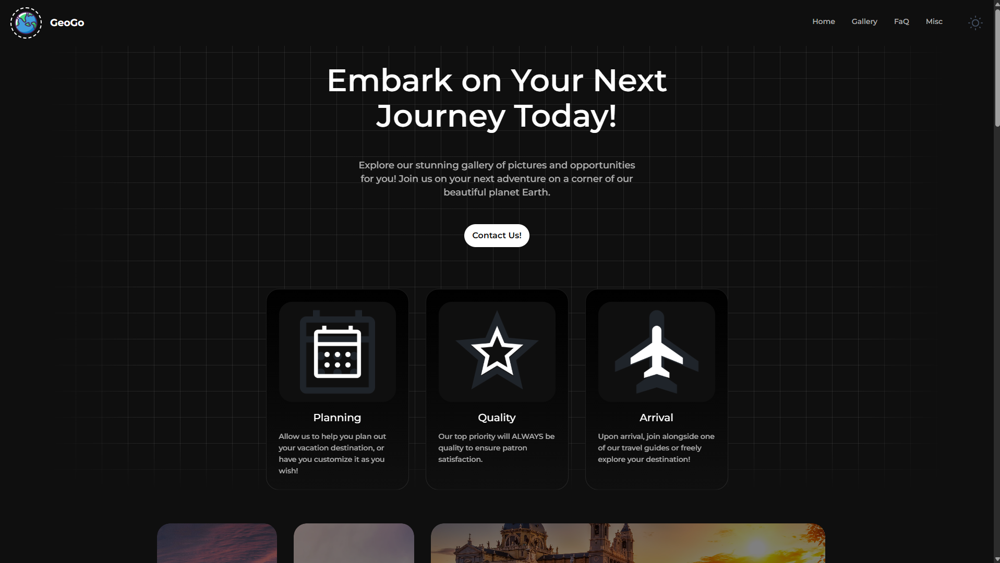
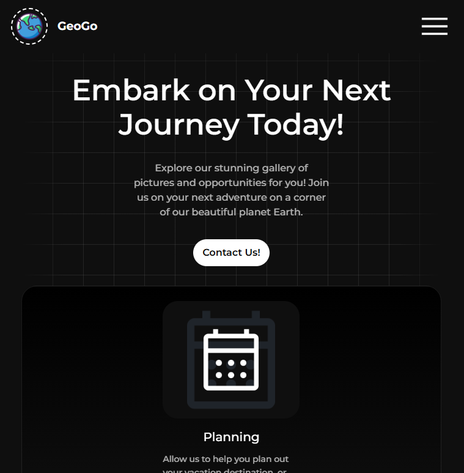
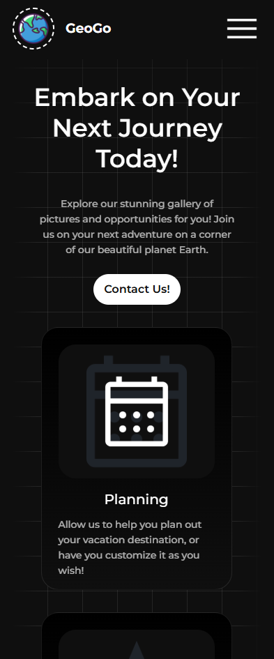

# GeoGo:

GeoGo (Designed in Figma first and later developed using React) is the website to a fictional travel agency and includes dynamic loading animations, a theme toggle, modern design and is my first React-based project!

## Project Structure:

### HTML:
- `index.html`: The main file of the project that contains the user interface and markup

### CSS:
- `style.css`: All of the significant styles are located here! Including the font imported, CSS variables (including colors and font sizes), as well as many common classes used throughout the project!
### Other CSS documents (All style their corresponding HTML section!):
- `header.css`
- `hero.css`
- `travel.css`
- `photography.css`
- `questions.css`
- `guests.css`
- `memories.css`
- `footer.css`

### React (JSX code - All of which include dynamic loading animations!):
- `main.jsx`: Main centerpiece of the project, in which ALL components are imported and integrated.
- `Header.jsx`: Includes a navbar for both desktop and mobile screens, as well as a theme toggle.
- `Hero.jsx`: Serves as the landing page of the website, and provides initial information.
- `Travel.jsx`: Shows pictures of tourist destinations in the form of a bento-grid.
- `Photography.jsx`: Provides additional images for popular destinations.
- `Questions.jsx`: Shows frequently asked questions as well as a toggle to view the answers.
- `Guests.jsx`: Provides (mimic) statistics about guests and patrons.
- `Memories.jsx`: Simple near-footer advertising to travel with us, as well as a contact button.
- `Footer.jsx`: Link to (my personal) GitHub and LinkedIn

## Functionality

- Theme toggle.
- Desktop and mobile menu.
- Links to GitHub, send an Email and LinkedIn.
- The website is fully responsive and adapts to different screen sizes!

## Responsiveness: 

### iPad:

### iPhone / Mobile Devices:

